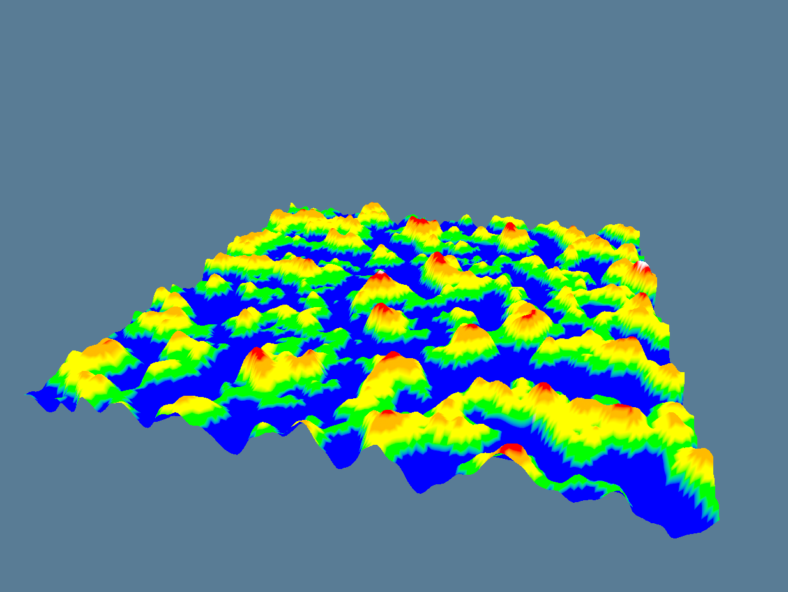

# Terraingen with Rust

This is a simple project to generate terrain with Rust. I am implementing Perlin Noise for creating a heighmap and using wgpu crate to render it.

### Resources:
- [wgpu tutorial](https://sotrh.github.io/learn-wgpu/)
- [Perlin Noise](https://rtouti.github.io/graphics/perlin-noise-algorithm)
- [Perlin Noise 2](https://www.scratchapixel.com/lessons/procedural-generation-virtual-worlds/perlin-noise-part-2/perlin-noise.html)

